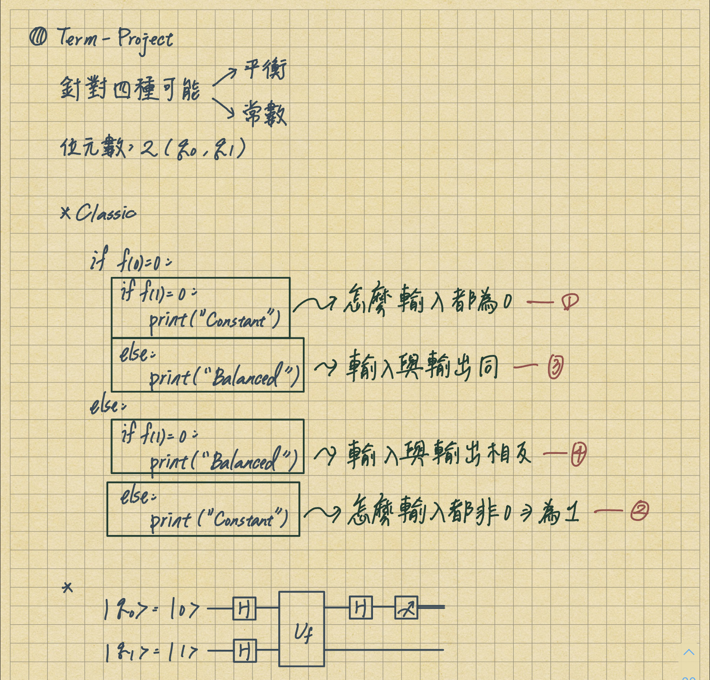

# Quantum-Oracle

This is the side project of the quantum algorithm, the source comes from the course -> CE3005 - Algorithmics.

What we wnat to do in this project is judging the black box function whether balanced or constant; therefore, there are four possibilities.

## pre-analyzing

## Four statuses
* ### [Constant: Output equal 0.](https://github.com/1chooo/Quantum-Oracle/blob/main/prog01.py)
    欲使任何輸入（q0不論是0或1）至函數中且全部結果（q1）為0，也就代表q1之值不會受q0所影響，所以神諭（Oracle）選用I閘，如此q1便不受q0影響，且從量子電腦模擬以及量子電腦的執行結果，結果為 |0> 的機率都接近100%；|1> 的機率都接近0%，因此此黑箱函數為常數函數。

* ### [Constant: Output equal 1.](https://github.com/1chooo/Quantum-Oracle/blob/main/prog02.py) 
    欲使任何輸入（q0不論是0或1）至函數中且全部結果（q1）為1，也就代表q1之值不會受q0所影響，所以神諭（Oracle）選用X閘，如此q1便不受q0影響，並且全都會變成1，且從量子電腦模擬以及量子電腦的執行結果，結果為 |0> 的機率都接近100%；|1> 的機率都接近0%，因此此黑箱函數為常數函數。

* ### [Balanced: Input equal Output.](https://github.com/1chooo/Quantum-Oracle/blob/main/prog03.py)
    欲使函數為平衡函數，因而挑選CNOT閘，並且讓q0為控制位元；q1為目標位元，當啟動CNOT閘時，q1會從0轉至1；不啟動CNOT閘時，q1會從1轉至0；進而做出輸出與輸入相等，且從量子電腦模擬以及量子電腦的執行結果，結果為 |1> 的機率都接近100%；|0> 的機率都接近0%，因此此黑箱函數為平衡函數。

* ### [Balanced: Input not equal Output.](https://github.com/1chooo/Quantum-Oracle/blob/main/prog04.py)
    欲使函數為平衡函數，因而挑選CNOT閘，並且讓q0為控制位元；q1為目標位元，但是當啟動CNOT閘前，q1會先經過X閘所以所以q1會先經過轉至，q1會從0轉至1；1轉至0，接著透過CNOT閘，進而做出輸出與輸入相反，且從量子電腦模擬以及量子電腦的執行結果，結果為 |1> 的機率都接近100%；|0> 的機率都接近0%，因此此黑箱函數為平衡函數。