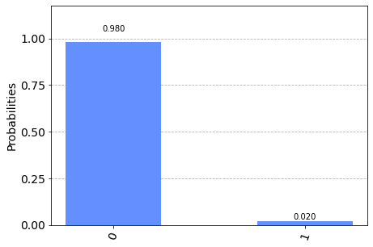
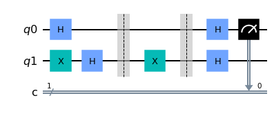
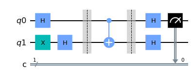
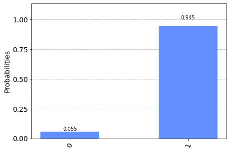
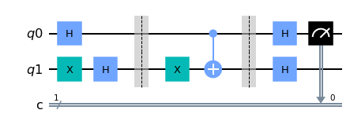
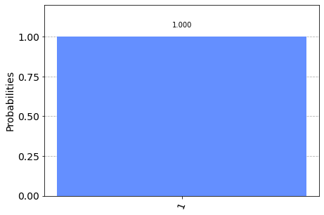

# Quantum-Oracle

This is the side project of the quantum algorithm, the source comes from the course -> CE3005 - Algorithmics.

What we wnat to do in this project is judging the black box function whether balanced or constant; therefore, there are four possibilities.

## Usage
```shell
pip install --upgrade pip
pip install virtualenv
virtualenv venv --python=python3.9
source venv/bin/activate

pip install ipykernel

pip install qiskit
pip install matplotlib
pip install pylatexenc

pip install mkdocs
pip install mkdocs-material
pip install pymdown-extensions
pip install mkdocstrings
pip install mkdocs-git-revision-date-plugin
pip install mkdocs-jupyter

deactivate
rm -rf venv     # remove the venv
```

### With `requirements.txt`
```shell
pip install --upgrade pip
pip install virtualenv
virtualenv venv --python=python3.9
source venv/bin/activate

pip install ipykernel
pip install -r requirements.txt

deactivate
rm -rf venv     # remove the venv
```

### pre-analyzing


## Four statuses

### Constant: Output equal 0.
欲使任何輸入（q0不論是0或1）至函數中且全部結果（q1）為0，也就代表q1之值不會受q0所影響，所以神諭（Oracle）選用I閘，如此q1便不受q0影響，且從量子電腦模擬以及量子電腦的執行結果，結果為 |0> 的機率都接近100%；|1> 的機率都接近0%，因此此黑箱函數為常數函數。

|       What I have done        |        Plot Display         |
| :---------------------------: | :-------------------------: |
|    Create quantum circuit     |  |
|   prove through histogram.    |  |
| Also prove in IBM Q Computer. |  |

### Constant: Output equal 1
欲使任何輸入（q0不論是0或1）至函數中且全部結果（q1）為1，也就代表q1之值不會受q0所影響，所以神諭（Oracle）選用X閘，如此q1便不受q0影響，並且全都會變成1，且從量子電腦模擬以及量子電腦的執行結果，結果為 |0> 的機率都接近100%；|1> 的機率都接近0%，因此此黑箱函數為常數函數。

|       What I have done        |        Plot Display         |
| :---------------------------: | :-------------------------: |
|    Create quantum circuit     |  |
|   prove through histogram.    |  |
| Also prove in IBM Q Computer. |  |


### Balanced: Input equal Output.
欲使函數為平衡函數，因而挑選CNOT閘，並且讓q0為控制位元；q1為目標位元，當啟動CNOT閘時，q1會從0轉至1；不啟動CNOT閘時，q1會從1轉至0；進而做出輸出與輸入相等，且從量子電腦模擬以及量子電腦的執行結果，結果為 |1> 的機率都接近100%；|0> 的機率都接近0%，因此此黑箱函數為平衡函數。

|       What I have done        |        Plot Display         |
| :---------------------------: | :-------------------------: |
|    Create quantum circuit     |  |
|   prove through histogram.    |  |
| Also prove in IBM Q Computer. |  |

### Balanced: Input not equal Output.
欲使函數為平衡函數，因而挑選CNOT閘，並且讓q0為控制位元；q1為目標位元，但是當啟動CNOT閘前，q1會先經過X閘所以所以q1會先經過轉至，q1會從0轉至1；1轉至0，接著透過CNOT閘，進而做出輸出與輸入相反，且從量子電腦模擬以及量子電腦的執行結果，結果為 |1> 的機率都接近100%；|0> 的機率都接近0%，因此此黑箱函數為平衡函數。

|       What I have done        |        Plot Display         |
| :---------------------------: | :-------------------------: |
|    Create quantum circuit     |  |
|   prove through histogram.    |  |
| Also prove in IBM Q Computer. |  |

## Reference
- [Introduction to quantum computing: The Deutsch algorithm.](https://akyrillidis.github.io/notes/quant_post_8)